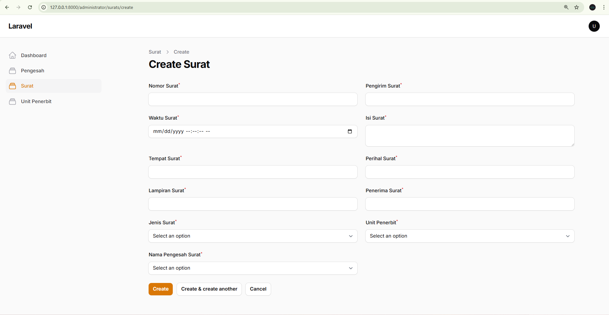

<p align="center">
  <a href="https://laravel.com" target="_blank">
    
  </a>
</p>

<p align="center">
  <a href="https://github.com/laravel/framework/actions">
    
  </a>
  <a href="https://packagist.org/packages/laravel/framework">
    
  </a>
  <a href="https://packagist.org/packages/laravel/framework">
    
  </a>
  <a href="https://packagist.org/packages/laravel/framework">
    
  </a>
</p>

---

## Sistem Pengelolaan Surat Masuk & Surat Keluar

Aplikasi ini dibangun menggunakan **Laravel** dengan integrasi **Laravel Filament** sebagai dashboard admin, sistem ini dirancang untuk membantu instansi/organisasi dalam mengelola proses administrasi surat masuk dan surat keluar secara lebih efisien dan terstruktur.

### Fitur Utama

-   **Manajemen Surat Masuk** → mencatat, menyimpan, dan menampilkan data surat masuk.
-   **Manajemen Surat Keluar** → membuat dan mengelola surat keluar dengan mudah.
-   **Manajemen Pengesah & Penerbit** → mencatat data pejabat atau pihak yang terkait dengan surat.
-   **Dashboard Filament** → tampilan admin modern dengan kemudahan akses dan pengelolaan data.
-   **Autentikasi User** → login aman untuk admin/petugas.

---

## Screenshots

<table align="center">
  <tr>
    <td align="center" width="50%">
      <strong>Login Page</strong><br><br>
      
    </td>
    <td align="center" width="50%">
      <strong>Surat Page</strong><br><br>
      
    </td>
  </tr>
   <tr>
    <td align="center" width="50%">
      <strong>Dashboard Page</strong><br><br>
      
    </td>
    <td align="center" width="50%">
      <strong>Top Rated Page</strong><br><br>
      
    </td>
  </tr>
  <tr>
    <td align="center" width="50%">
      <strong>Pengesah Page</strong><br><br>
      
    </td>
    <td align="center" width="50%">
      <strong>Penerbit Page</strong><br><br>
      
    </td>
  </tr>
  
</table>

---

## ⚙️ Teknologi yang Digunakan

-   [Laravel 11+](https://laravel.com/) – Framework utama
-   [Laravel Filament](https://filamentphp.com/) – Dashboard admin
-   MySQL / MariaDB – Database
-   TailwindCSS – Styling
-   PHP 8+

---

## 🚀 Cara Menjalankan Project

1. Clone repository
    ```bash
    git clone https://github.com/username/nama-project.git
    cd nama-project
    ```
